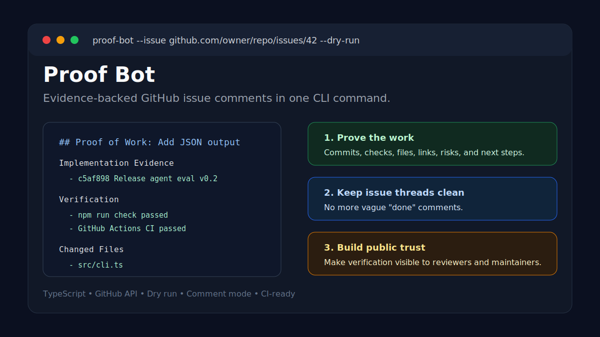

# Proof Bot

[](https://github.com/P-r-e-m-i-u-m/proof-bot/actions/workflows/ci.yml)
[](LICENSE)

Turn GitHub issue threads from "done" into clear engineering evidence.



Proof Bot is a TypeScript CLI that generates evidence-backed proof-of-work comments for GitHub issues and pull requests.

Most issue threads end with "done". Proof Bot makes the final comment stronger: what changed, how it was verified, what files moved, what risks remain, and what comes next.

## Why It Exists

Professional engineering is not only shipping code. It is proving the work is safe, reviewed, and traceable. Proof Bot gives every issue a clean evidence trail.

## Features

| Feature | Status |
| --- | --- |
| GitHub issue and PR URL parsing | Done |
| Markdown proof report generation | Done |
| Dry-run mode | Done |
| GitHub issue comment mode | Done |
| Optional issue title/state fetching | Done |
| TypeScript library exports | Done |
| Tests and CI | Done |

## Quick Start

```bash
npm install
npm run demo
npm test
```

## Use It When

- You close an issue and want the evidence visible.
- You merge a PR and want a clean verification summary.
- You maintain multiple repos and want consistent issue hygiene.
- You want reviewers to see commits, checks, files, risks, and next steps without digging.

## CLI Example

```bash
npm run build
node dist/src/cli.js \
  --issue https://github.com/P-r-e-m-i-u-m/ai-agent-evaluation-kit/issues/6 \
  --commit c5af898 \
  --check "npm run check passed" \
  --check "GitHub Actions CI passed" \
  --file src/cli.ts \
  --link https://github.com/P-r-e-m-i-u-m/ai-agent-evaluation-kit/releases/tag/v0.2.0 \
  --dry-run
```

## Posting A Comment

```bash
GITHUB_TOKEN=ghp_xxx node dist/src/cli.js \
  --issue https://github.com/owner/repo/issues/1 \
  --commit abc1234 \
  --check "npm test passed" \
  --comment
```

`--comment` fetches issue metadata and posts the generated proof as a GitHub issue comment.

## Output Shape

```md
## Proof of Work

### Implementation Evidence
- Commit hash or PR link

### Verification
- npm test passed
- CI passed

### Changed Files
- src/cli.ts

### Risks And Follow-Up
- Known limitations
```

## Documentation

- [Workflow guide](docs/WORKFLOW.md)
- [GitHub Actions usage](docs/GITHUB_ACTIONS.md)
- [Demo output](docs/DEMO_OUTPUT.md)
- [Example proof comment](examples/proof-example.md)
- [Changelog](CHANGELOG.md)

## Roadmap

- Auto-detect commits from a branch
- Generate proof from a merged pull request
- Add GitHub Actions summary mode
- Support JSON output
- Add reusable workflow examples

## License

MIT
